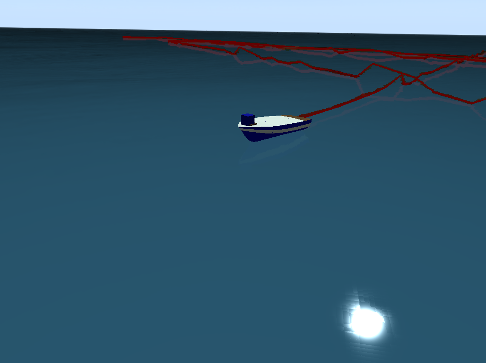
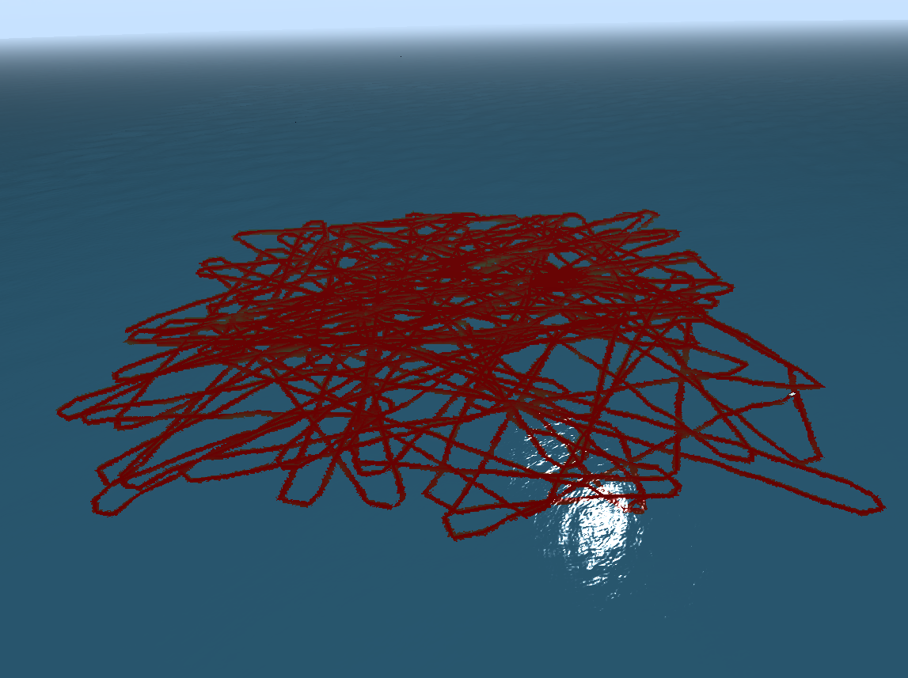

# nta_rl
## Background
The purpose of ```nta_rl``` is to learn the behavior of a ship using its network traffic data and detect malicious attacks on the network traffic. 

## Overview
There are two main components of this repository. The ```data collection``` component and the ```machine learning``` component. 

## Data Collection
To simulate a ship, the [usv_sim_lsa](https://github.com/disaster-robotics-proalertas/usv_sim_lsa) repository was slightly modified. The purpose behind modifying the simulator is to collect network traffic data by subscribing to various topics, generate and specify waypoints for the ship to navigate to using a PID controller, and make visual improvements. Each file within this simulator that was updated is stored within the ```data_collection/simulator_changed_scripts/``` directory. Additionally, a new submodule called ```nta_rl_data_collection``` was added to the simulator. All these changes to the simulator are stored within [this](https://github.com/jasonjabbour/usv_sim_lsa.git) forked repository. 

To install this modified simulator, follow the instructions below:

### Installing the Simulator

#### Installing ROS
You need Ubuntu Linux 16.04 since the current version of this simulator uses ROS Kinetic. To install ROS Kinetic and some additional packages, run the following commands:


        sudo sh -c 'echo "deb http://packages.ros.org/ros/ubuntu $(lsb_release -sc) main" > /etc/apt/sources.list.d/ros-latest.list'
        sudo apt-key adv --keyserver 'hkp://keyserver.ubuntu.com:80' --recv-key C1CF6E31E6BADE8868B172B4F42ED6FBAB17C654
        sudo apt-get update
        sudo apt-get install ros-kinetic-desktop-full ros-kinetic-control-* ros-kinetic-osg-markers ros-kinetic-move-base -y
        sudo rosdep init
        rosdep update
        sudo echo "source /opt/ros/kinetic/setup.bash" >> ~/.bashrc
        source ~/.bashrc

Now run the following commands to download the dependencies of usv_sim:

        sudo apt-get install python-rosinstall python-rosinstall-generator python-wstool build-essential python-rosdep python-wxtools python-lxml python-pathlib python-h5py python-scipy python-geolinks python-gdal -y
        sudo apt-get install libfftw3-* libxml++2.6-* libsdl-image1.2-dev libsdl-dev -y

To run the packages of usv_sim you need a catkin workspace. If you already have a workspace you may jump to the Downloading and installing subsection.

#### Creating a catkin workspace

        source /opt/ros/kinetic/setup.bash
        mkdir -p ~/catkin_ws/src
        cd ~/catkin_ws/
        catkin_make

#### Downloading and installing usv_sim stack

Clone the usv_sim repository in the src folder of your catkin workspace:

        cd ~/catkin_ws/src
        git clone https://github.com/jasonjabbour/usv_sim_lsa.git
        cd usv_sim_lsa
        git submodule init
        git submodule update


##### Sanity Check (No need to execute the following commands)

Verify that the [nta_rl_data_collection](https://github.com/jasonjabbour/nta_rl_data_collection) repository has been cloned within the ```usv_sim_lsa/usv_navigation``` directory). 

nta_rl_data_collection

        cd ~/catkin_ws/src/usv_sim_lsa/usv_navigation/nta_rl_data_collection

Verify that the other modified files with the simulator can be found in these directories.

CMakeLists.txt 

        cd ~/catkin_ws/src/usv_sim_lsa/usv_navigation/

patrol_pid_scene_j1.py

        cd ~/catkin_ws/src/usv_sim_lsa/usv_navigation/scripts/

rudder_control_heading.py

        cd ~/catkin_ws/src/usv_sim_lsa/usv_base_ctrl/scripts/

rudderboat_scenario_j1.launch

        cd ~/catkin_ws/src/usv_sim_lsa/usv_sim/launch/scenarios_launchs

rudderboat_scenario_j1.xml

        cd ~/catkin_ws/src/usv_sim_lsa/usv_sim/scenes

#### Run the Installation script:

        cd ~/catkin_ws/src/usv_sim_lsa
        chmod +x ./install_usv_sim 
        ./install_usv_sim

#### Install the dependencies:

        rosdep install --from-paths src --ignore-src --rosdistro kinetic -y

#### Compile the stack:

        cd ~/catkin_ws/
        catkin_make_isolated --install
        source install_isolated/setup.bash

### Collect Data:

The ```digital_twin_data_collection.py``` script collects data of a ship navigating to various waypoints. Waypoints are generated at random within specified boundaries. The ship will continuously navigate to each waypoint using a PID controller. Data will be collected while the ship navigates to its instructed waypoints by subscribing to various ROS topics. The rudderboat_scenario_j1.xml holds environmental parameters such as wind speed and should be modified as needed. 

#### Ship Navigating to a Waypoint


#### Ship Navigating to 300 Waypoints


#### Increasing Wind Speed


#### Terminal 1

Initialize the ROS Master Node

	roscore
		
#### Terminal 2

Source your workspace, generate the parsed spawner launch file, then launch your simulator. (The rudderboat_scenario_j1 must first be parsed in order to create the spawner launch file.) To make data collection changes, the ```usv_sim_lsa/usv_navigation/nta_rl_data_collection/digital_twin_data_collection.py``` script can be modified. 

        source install_isolated/setup.bash
        roslaunch usv_sim rudderboat_scenario_j1.launch parse:=true
        roslaunch usv_sim rudderboat_scenario_j1.launch parse:=false

#### Terminal 3

Unpause gazebo. (```digital_twin_data_collection.py``` will take care of this, but running the following command will help when simulator is frozen.)

	rosservice call /gazebo/unpause_physics "{}"


### Troubleshooting (not necessary if everything is working)

##### Fixing Gazebo not finding Sun Model
	
        gedit ~/.bashrc

Add and Save to end
	
        export GAZEBO_MODEL_DATABASE_URI="http://models.gazebosim.org/"
        . ~/.bashrc

## Learning Ship Behavior

Once the data is collected, we can train models using the ```nta_rl``` repository to learn the behavior of a ship's network traffic data. The RL toolchain consists of stable-baselines3 and OpenAI Gym. The purpose of learning ship behavior is to determine a confidence level for future timesteps. If the network traffic data is maliciously altered, the policy should indicate low confidence for the manipulated data streams. 

### Clone the nta_rl Repository

        git clone https://github.com/jasonjabbour/nta_rl.git
        cd nta_rl
        git submodule init
        git submodule update

### Updating Data

Place any .csv files collected from the simulator within the ```nta_rl/data_collection/data/``` directory

### Environment Setup

Create a Conda Environment

        conda create --name nta-rl-env python=3.9
        conda activate nta-rl-env

Install Dependencies

        pip install gym
        pip install stable-baselines3[extra]
        pip install tensorboard
        pip install attrs
        
### Train an RL Policy

Specify the algorithm and policy number at the top of digital_twin.py

        cd nta_rl
        python digital_twin.py --mode train

### Test an RL Policy 

Specify the algorithm and policy number at the top of digital_twin.py

        cd nta_rl
        python digital_twin.py --mode test


## General Troubleshooting

### Ubunto 18.04 Autosize Issue:
	
        sudo apt install open-vm-tools open-vm-tools-desktop        
        sudo systemctl edit open-vm-tools.service  

Add and save in pop-up window:
	[Unit]
	Requires=graphical.target
	After=graphical.target

        reboot

# Sources:
usv_sim_lsa paper: https://www.mdpi.com/1424-8220/19/5/1068

usv_sim_lsa repository: https://github.com/disaster-robotics-proalertas/usv_sim_lsa

UWSim: https://github.com/uji-ros-pkg/underwater_simulation

